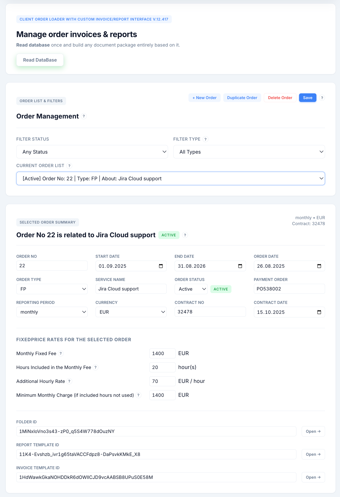
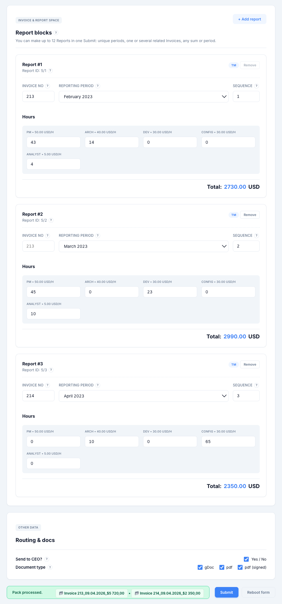

# Demo Flow

This walkthrough shows the real user path in the demo web app from input to generated files.



## Step 1: Input and Selection

- Open the web interface.
- Click `Read DataBase` to load orders from the connected source.
- Select one order for processing.

Sample order used in this demo:

```text
Order No: 5
Billing Model: TM
Reporting Window: Monthly
```

Input form example used during selection and preparation:



## Step 2: Validation

Before processing, the system validates user input and required fields.

Typical checks include:

- required identifiers are present
- at least one report block exists
- reporting periods are not duplicated in one run
- totals are not zero for submitted blocks

## Step 3: Processing

After validation, the processing layer:

- normalizes submission data
- applies billing rules for selected model
- recalculates totals server-side
- prepares generation instructions for output artifacts

## Step 4: Output Generation

The system generates output artifacts according to selected formats.

Typical output set:

- editable document format (gDoc)
- PDF export
- signed PDF export (when selected)

## Step 5: Result and Traceability

At completion, the user receives links to generated artifacts and can review results in storage: https://drive.google.com/drive/folders/1T7l4R3PMPFFR2-jJxzz9QeDYiwZDUg5h

Each run is logged to support auditability and rerun analysis.

## User Perspective Summary

Input -> Validate -> Process -> Generate -> Review

## Navigation

- [Back to README](README.md)
