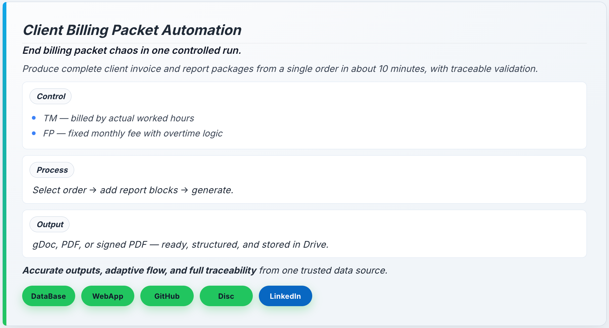

# Order Loader Public Demo: Recurring Billing Documents in Minutes

This public demo shows a Google Workspace automation flow that turns recurring billing input into ready invoice and report packages in one run.

For teams closing routine contractor billing, it replaces fragmented manual assembly with a guided and traceable process.

Typical preparation time moves from about 2 working days to about 10 minutes.

## Key Capabilities

- Handles both billing models in one process: TM (hour-based) and FP (fixed monthly with overtime logic)
- Generates complete document outputs in one run: gDoc, PDF, and signed PDF
- Recalculates totals server-side before output so generated totals match validated inputs
- Keeps each run traceable with logging and repeatable generation steps
- Preserves prior artifacts during reruns with non-destructive output handling

## Outcome Snapshot

- Preparation time reduced from about 2 working days to about 10 minutes
- Manual document assembly risk reduced through deterministic generation
- Operational handoffs reduced for routine billing closure

## Demo Access

- Demo Viewer: https://docs.google.com/spreadsheets/d/1JUpzYpNbTBxQrUdxjW2XcXKGB2t9WTbv9pg12wPPLjg/edit?usp=sharing
- Deployed Application: https://script.google.com/macros/s/AKfycbx2oa6XNMUjDHL7GLhG693FovAVhuLafTBeWe8G9y7H5uFZLFioAqAMAqUCO0-ndvBg/exec
- Public Showcase Repository: https://github.com/keindabest/sc-demo-invoice-report-creator-showcase

## Quick How to Try Demo

1. Open the deployed application.
2. Load available order data from the connected container.
3. Select an order and configure report blocks.
4. Choose output types (gDoc, PDF, signed PDF).
5. Run generation and review produced artifacts.

## Demo Documentation Map

- Start here: [OVERVIEW.md](OVERVIEW.md) -> [DEMO_FLOW.md](DEMO_FLOW.md) -> [ARTIFACTS.md](ARTIFACTS.md)
- [FEATURES.md](FEATURES.md)
- [ARCHITECTURE.md](ARCHITECTURE.md)
- [USE_CASES.md](USE_CASES.md)
- [SECURITY_AND_DISCLOSURE.md](SECURITY_AND_DISCLOSURE.md)
- [DEPLOYMENT.md](DEPLOYMENT.md)
- [LICENSE](LICENSE)

## Disclosure (Short)

This is a sanitized public demo package. Production-specific orchestration details, sensitive naming patterns, and client-specific implementation workflows are intentionally excluded.

## License

This project is licensed under the MIT License. See LICENSE.

## Author

Daniel Kein
https://www.linkedin.com/in/daniel-kein/
